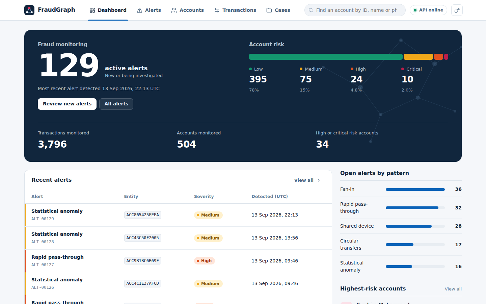
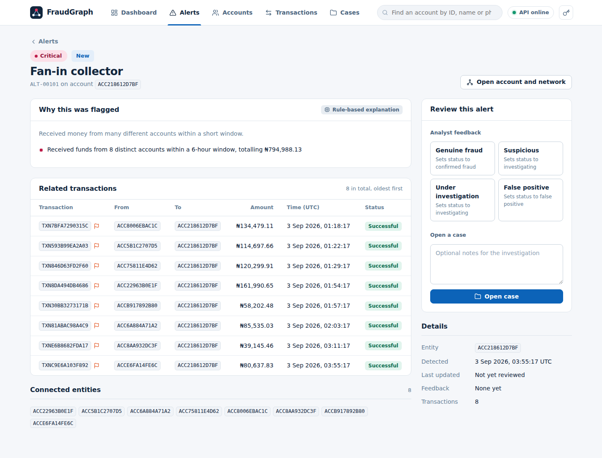

# FraudGraph

**Graph-based fraud detection and investigation for banks.** Built for the Ecobank InnovateX 2026 challenge.

FraudGraph turns a bank's transaction data into a network of accounts, devices and transfers, finds the shapes
that money-mule and laundering rings leave behind, scores every account from 0 to 100, and gives analysts a
console to see *why* something was flagged, explore the surrounding network, and work the alert to a decision.



---

## What it does

| Capability | How |
|---|---|
| **Finds fraud rings** | Four graph and time-window detectors: fan-in (collector and feeder accounts), circular transfers, shared devices, and rapid pass-through |
| **Catches what the rules miss** | A Random Forest (supervised) and an Isolation Forest (unsupervised) add a second opinion |
| **Scores every account 0 to 100** | Rules and ML are blended, and a strong rule finding is never diluted. Bands: low, medium, high, critical |
| **Explains itself** | Every alert carries plain-language reasons. Gemini can optionally reword them, but never changes what is detected or scored |
| **Lets analysts act** | Give feedback on an alert, open a case, track it to closure; the dashboard's active-alert count falls as work completes |
| **Shows the network** | An interactive graph of any account's neighbourhood, 1 to 3 hops out |


*A fan-in collector (centre, critical) with the accounts feeding it and the devices they use. Warm edges link
accounts that are both flagged.*

---

## Architecture

```
 data/*.csv ──► seed.py ──► detection + ML pipeline ──► PostgreSQL ──► FastAPI /api/v1 ──► React frontend
 (accounts,      (batch,      4 rule detectors             (scores,        (read + analyst      (analyst console
  devices,       all-or-      Random Forest                 alerts,         write actions)        with graph view)
  transactions)  nothing)     Isolation Forest              cases)
                              explanations (+ optional Gemini)
```

Detection runs as a **batch** when you seed the database; the API only reads precomputed results, so API latency
does not depend on data size. See [`docs/DOCUMENTATION.md`](docs/DOCUMENTATION.md) for the full design.

```
FraudGraph/
├── backend/     FastAPI + PostgreSQL + detection and ML pipeline   (see backend/README.md)
├── frontend/    React + Vite analyst console                       (see frontend/README.md)
└── docs/        Full documentation and screenshots
```

---

## Quick start

You need Python 3.10+, Node 18+ and Docker (for PostgreSQL).

**1. Backend**

```bash
cd backend
pip install -r requirements.txt
docker compose up -d                 # PostgreSQL
cp .env.example .env
python -m app.seed                   # load data, run detection + ML (rebuilds all tables)
uvicorn app.main:app --reload --port 8000
```

Interactive API docs: <http://localhost:8000/docs> &nbsp;·&nbsp; health: <http://localhost:8000/health>

**2. Frontend**

```bash
cd frontend
npm install
npm run dev                          # http://localhost:5173
```

Open <http://localhost:5173>. The top bar shows a green **API online** pill when the frontend can reach the
backend.

> The backend only accepts browser calls from the origins in `CORS_ORIGINS` (default `http://localhost:3000`
> and `http://localhost:5173`). To use another origin, add it in `backend/.env`. To point the frontend at a
> different API, set `VITE_API_BASE_URL` in `frontend/.env`.

**Optional**

- `API_KEY` in `backend/.env` turns on `X-API-Key` authentication; the frontend then asks for the key.
- `GEMINI_API_KEY` in `backend/.env` enables reworded explanations. Leave it blank and nothing is sent anywhere.

---

## A tour of the console

| Screen | What you do there |
|---|---|
| **Dashboard** | See active alerts, how accounts spread across risk bands, recent alerts, and the highest-risk accounts |
| **Alerts** | Filter by severity, status, pattern or entity; open any alert |
| **Alert detail** | Read why it was flagged, review the related transactions, give feedback, open a case |
| **Accounts** | Search by ID, name or phone; filter by risk level and city |
| **Account detail** | Risk dial, ML and anomaly scores, detected patterns, the **network graph**, recent transactions |
| **Transactions** | Filter by account, device, IP, amount, date, status, flagged; click a row for details |
| **Cases** | Track investigations; change status and notes |



### Where is the graph?

Open **Accounts**, click any account, and scroll to **Transaction network**. Switch between 1, 2 and 3 hops,
toggle devices, click a node to inspect it, double-click to open it, or go full screen. Details are in
[the graph guide](docs/DOCUMENTATION.md#7-reading-the-network-graph).

---

## How risk is scored (short version)

1. Each rule detector that fires adds a weight (fan-in collector 45, cycle member 40, statistical anomaly 35,
   rapid pass-through 30, shared-device member 20, fan-in feeder 15). A top-1% transfer adds 10, and each
   flagged neighbour adds 5 (capped at 20).
2. The ML layer produces a fraud probability and an anomaly score, blended 70/30.
3. If a rule fired, the final score is `max(rule score, 0.6 × rule + 0.4 × ML)`, so ML can raise a score but
   never lower a rule finding. If only the Isolation Forest flagged the account, it gets at least 35.
4. Bands: **low** below 31, **medium** 31 to 60, **high** 61 to 80, **critical** 81 and above.

---

## Honest notes on accuracy

- The bundled data is **synthetic**, and the fraud was planted with the same patterns the detectors look for.
  Near-perfect rule recall on it shows the detectors work as designed, not real-world accuracy.
- The ML AUC (about 0.9998) is a **pipeline demonstration**, not evidence of production performance.
- Thresholds in `backend/app/config.py` were tuned on this dataset and must be retuned on real data.
- Reproduce the numbers yourself with `python -m app.evaluate` (no database needed).

---

## Tests

```bash
cd backend && pip install -r requirements-dev.txt && pytest
```

The frontend has no automated test suite yet; see
[Testing and verification](docs/DOCUMENTATION.md#11-testing-and-verification) for what was checked and how.

---

## Not built (by design)

Live transaction streaming, real core-banking integration, bank-grade identity and audit logging, retraining from
analyst feedback, and historical trend analytics. See
[Limitations and roadmap](docs/DOCUMENTATION.md#13-limitations-and-roadmap).

---

## Documentation

- [`docs/DOCUMENTATION.md`](docs/DOCUMENTATION.md): architecture, detection logic, scoring, full API reference,
  workflows, frontend guide, configuration, troubleshooting
- [`backend/README.md`](backend/README.md): backend setup, PostgreSQL notes, accuracy, security, scaling
- [`frontend/README.md`](frontend/README.md): frontend setup, screen-to-endpoint map, behaviour notes
