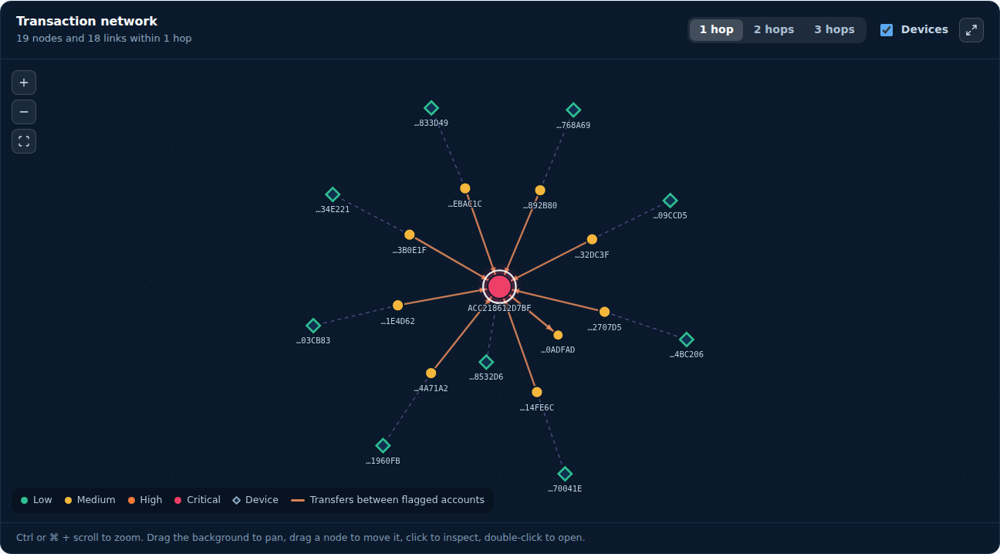
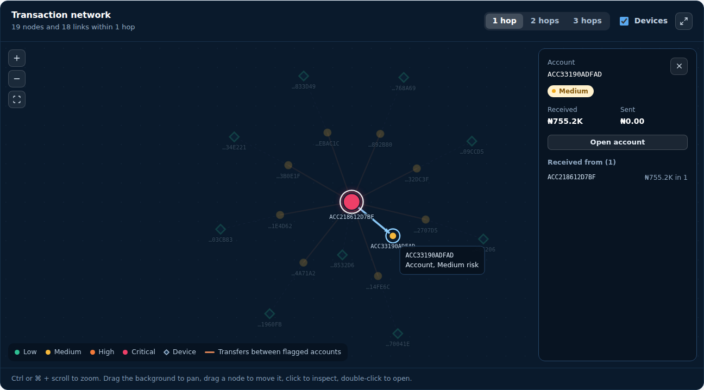
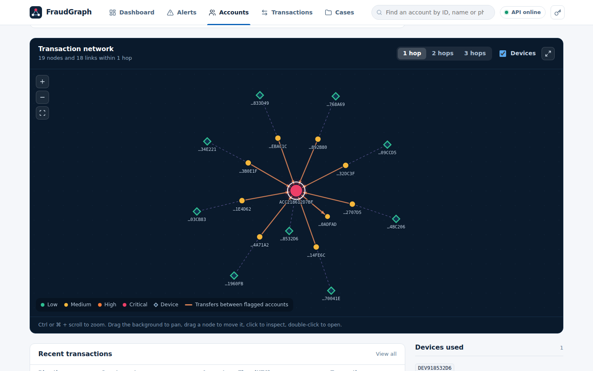

# FraudGraph Documentation

Graph-based fraud detection and investigation, built for the Ecobank InnovateX 2026 challenge.

## Contents

1. [Overview](#1-overview)
2. [Architecture](#2-architecture)
3. [Data model](#3-data-model)
4. [Detection and scoring](#4-detection-and-scoring)
5. [Explanations and Gemini](#5-explanations-and-gemini)
6. [API reference](#6-api-reference)
7. [Reading the network graph](#7-reading-the-network-graph)
8. [Analyst workflow](#8-analyst-workflow)
9. [Frontend guide](#9-frontend-guide)
10. [Configuration](#10-configuration)
11. [Testing and verification](#11-testing-and-verification)
12. [Security and privacy](#12-security-and-privacy)
13. [Limitations and roadmap](#13-limitations-and-roadmap)
14. [Troubleshooting](#14-troubleshooting)
15. [Glossary](#15-glossary)

---

## 1. Overview

### The problem

Fraud in retail banking is rarely a single bad transaction. Mule networks move money through many accounts in
patterns that only appear when you look at the *relationships* between accounts, devices and transfers: dozens of
accounts feeding one collector, money looping through a ring, one phone behind ten "customers", funds cashed out
minutes after they arrive.

### What FraudGraph does

1. Loads accounts, devices and transactions into PostgreSQL.
2. Builds the relationship graph between them.
3. Runs four rule-based detectors over that graph and over time windows.
4. Adds two ML models as a second opinion.
5. Scores every account from 0 to 100 and assigns a risk band.
6. Writes a plain-language explanation for every alert.
7. Serves everything through a REST API, consumed by an analyst console that also visualises the network.

### Design principles

- **Explainable first.** The detectors need no ML model and no API key. Every alert has a deterministic,
  rule-based explanation. ML and Gemini are additions, not dependencies.
- **Never dilute a strong finding.** ML can raise a score; it cannot lower one that a rule produced.
- **Honest about limits.** The bundled data is synthetic; accuracy figures describe the pipeline, not the real
  world (see [section 13](#13-limitations-and-roadmap)).

---

## 2. Architecture

```
┌────────────┐   ┌─────────────────────────────────────────────┐   ┌────────────┐
│ data/*.csv │──►│ seed.py: one all-or-nothing transaction     │──►│ PostgreSQL │
└────────────┘   │   pipeline.py                               │   └─────┬──────┘
                 │     detection.py  4 rule detectors + scoring│         │
                 │     features.py   26 features per account   │         │ reads
                 │     ml.py         Random Forest + Isolation │   ┌─────▼──────┐
                 │     explain.py    reasons (+ optional Gemini)│   │  FastAPI   │
                 └─────────────────────────────────────────────┘   │  /api/v1   │
                                                                   └─────┬──────┘
                                                                         │ JSON over HTTP
                                                                   ┌─────▼──────┐
                                                                   │ React app  │
                                                                   └────────────┘
```

**Batch compute, cheap reads.** Everything expensive happens when you run `python -m app.seed`. The API serves
precomputed results, so request latency does not grow with the number of transactions. The two write paths
(alert feedback, cases) are small row updates.

**All-or-nothing seeding.** The compute pipeline runs first; only then are tables rebuilt and written in a single
database transaction. A crash never leaves a half-loaded or wiped database.

### Technology

| Layer | Technology |
|---|---|
| API | Python, FastAPI, SQLAlchemy, Pydantic |
| Database | PostgreSQL (SQLite works for throwaway runs) |
| Detection | pandas, networkx, custom sliding-window and cycle search |
| ML | scikit-learn: Random Forest, Isolation Forest |
| Explanations | Rule-based text; optional Gemini rewording |
| Frontend | React 19, Vite, plain CSS, a hand-written canvas graph renderer |

### Repository layout

```
backend/
  app/
    config.py        settings: database, API key, CORS, Gemini, detection thresholds
    database.py      SQLAlchemy engine and session
    models.py        tables: Account, Device, Transaction, Alert, Case
    schemas.py       Pydantic request/response shapes
    security.py      optional X-API-Key check
    detection.py     four detectors and hybrid risk scoring
    features.py      behavioural and topological features
    ml.py            Random Forest (out-of-fold) and Isolation Forest
    pipeline.py      the whole compute pipeline, no database needed
    explain.py       rule-based explanations and optional Gemini polish
    graph_utils.py   node/edge construction for the network view
    seed.py          CSVs -> pipeline -> PostgreSQL
    evaluate.py      reproducible accuracy numbers
    main.py          FastAPI app
    routers/         dashboard, accounts, transactions, alerts, cases
  data/              accounts.csv, devices.csv, transactions.csv, ground_truth.csv
  tests/             pytest suite
frontend/
  src/
    api/client.js    one function per backend route
    lib/             router, formatting, display metadata, hooks
    components/      shared UI; components/graph/ holds the graph
    pages/           one file per screen
    styles/          design tokens and CSS
docs/                this file and screenshots
```

---

## 3. Data model

Five tables. Foreign keys are enforced.

| Table | Key columns |
|---|---|
| **Account** | `account_id`, `owner_name`, `phone`, `id_number`, `city`, `account_type`, `opened_date`, `risk_score`, `risk_level`, `flagged_patterns`, `ml_score`, `anomaly_score` |
| **Device** | `device_id`, `device_type`, `risk_level`, `flagged`, `linked_account_count` |
| **Transaction** | `txn_id`, `sender_account`, `receiver_account`, `amount`, `timestamp`, `channel`, `device_id`, `ip_address`, `location`, `status`, `flagged`, `flagged_reason` |
| **Alert** | `alert_id`, `entity_id`, `entity_type` (account or device), `pattern`, `severity`, `detected_at`, `status`, `feedback`, `updated_at`, `explanation`, `explanation_source`, `related_transactions`, `connected_entities` |
| **Case** | `case_id`, `alert_id`, `status`, `notes`, `related_entities`, `created_at`, `updated_at` |

### Identifiers

| Entity | Format | Example |
|---|---|---|
| Account | `ACC` + hex | `ACC218612D7BF` |
| Device | `DEV` + hex | `DEV918532D6` |
| Transaction | `TXN` + hex | `TXN813DC763767F` |
| Alert | `ALT-` + number | `ALT-00101` |
| Case | `FG-` + 8 hex characters | `FG-1A2B3C4D` |

### Value sets

| Field | Values |
|---|---|
| Risk level | `low`, `medium`, `high`, `critical` |
| Alert / case status | `new`, `investigating`, `confirmed`, `false_positive`, `closed` |
| Alert feedback | `genuine_fraud`, `suspicious`, `false_positive`, `under_investigation` |
| Transaction status | `successful`, `failed`, `pending`, `reversed` |
| Channel | `mobile_app`, `internet_banking`, `agent_banking`, `ussd`, `pos` |
| Explanation source | `rule_based`, `gemini` |

### Time

Timestamps are stored and returned as **naive UTC** (for example `2026-08-31T09:56:44`, no zone suffix). Clients
that parse these as local time will be off by their UTC offset. The frontend pins them to UTC and labels them.

---

## 4. Detection and scoring

### 4.1 Rule detectors

All thresholds live in `backend/app/config.py` and were tuned on the synthetic dataset.

| Pattern | Looks for | Default threshold |
|---|---|---|
| `fan_in_collector` | One account receiving from many distinct senders in a short window | 6 or more senders within 6 hours |
| `fan_in_feeder` | An account sending into a collector | Linked to a detected collector |
| `cycle_member` | Money travelling around a ring and returning to an earlier account | Cycle length up to 6, within 24 hours, each transfer at least ₦50,000 |
| `shared_device_member` | An account transacting from a device that many accounts use | 4 or more distinct accounts on one device |
| `rapid_passthrough` | Money received, then mostly sent on within minutes | 45-minute window, at least 80% of the inbound amount, at least ₦50,000 |

A **device-level** alert (`shared_device`) is raised for the device itself. Its severity scales with the number of
accounts sharing it: medium below 6, high from 6, critical from 10.

### 4.2 Machine-learning layer

| Model | Role | Notes |
|---|---|---|
| Random Forest | Supervised fraud probability | 100 trees, depth 8, balanced classes. The per-account `ml_score` is **out-of-fold**: each account is scored by a model that never saw its label |
| Isolation Forest | Unsupervised anomaly score | Configured to surface the most unusual ~8% of accounts for review, by design |

Both consume 26 behavioural and topological features per account (see `features.py`).

### 4.3 Hybrid risk score

**Step 1: rule score**

| Contribution | Points |
|---|---|
| `fan_in_collector` | 45 |
| `cycle_member` | 40 |
| `statistical_anomaly` | 35 |
| `rapid_passthrough` | 30 |
| `shared_device_member` | 20 |
| `fan_in_feeder` | 15 |
| `large_amount_anomaly` (a transfer in the top 1% by amount) | +10 |
| Each neighbour hit by a real rule detector | +5, capped at +20 |

The rule score is capped at 100.

**Step 2: blend with ML**

```
ml_blend = 0.70 × (ML probability × 100) + 0.30 × (anomaly score × 100)

if rule_score > 0:     score = max(rule_score, 0.60 × rule_score + 0.40 × ml_blend)
elif Isolation Forest flagged it:
                       score = max(35, 0.60 × ML + 0.40 × anomaly)
else:                  score = 0.20 × ML
```

The `max(...)` in the first branch is the high-water mark: ML can raise a rule-based score, never lower it.

**Step 3: band**

| Band | Score |
|---|---|
| Low | below 31 |
| Medium | 31 to 60 |
| High | 61 to 80 |
| Critical | 81 and above |

Band cutoffs are `risk_band_*` in `config.py`.

### 4.4 Alerts

- One alert per detected pattern per entity.
- `detected_at` is the timestamp of the transaction that **completed** the pattern, so recent alerts are ordered by
  when the fraud happened, not when the seed ran.
- Account alerts take the account's risk level as their `severity`; device alerts use the rule above.
- Alerts start as `status: new`.

---

## 5. Explanations and Gemini

Every alert has an `explanation`: a list of plain sentences built from the evidence, for example:

> Received funds from 8 distinct accounts within a 6-hour window, totalling ₦794,988.13

> Received ₦80,637.83, then sent out a much larger ₦755,238.72 just 26.0 minutes later — consistent with cashing
> out several pooled inbound transfers at once

`explanation_source` is `rule_based` or `gemini`.

**Gemini is optional and cosmetic.** It only rewords the existing sentences. It does not decide what is detected
or how risk is scored. If the key is blank, wrong, or Gemini is unreachable, the rule-based text stays. After three
consecutive failures Gemini is switched off for the rest of that seed run.

Privacy guard rails (see also [section 12](#12-security-and-privacy)):

- Account and device IDs are replaced with placeholders (`ACCOUNT_A`, `DEVICE_A`) before sending, then restored.
- A Gemini reply is rejected, and the rule-based text kept, if it introduces any number or identifier that was not
  in the facts.

`GET /accounts/{id}` merges the explanations of **all** of that account's alerts, plus a line for the
large-amount outlier when it applies.

---

## 6. API reference

Base URL: `http://localhost:8000`. Interactive documentation: `/docs`.

### Conventions

- All business routes are under **`/api/v1`**. `/health` and `/` are open.
- If `API_KEY` is set, send it as the `X-API-Key` header. A missing or wrong key returns `401`.
- JSON in, JSON out. Errors use FastAPI's shape: `{"detail": "message"}` (or a list of validation errors for `422`).
- CORS allows only the origins in `CORS_ORIGINS`, with the methods `GET`, `POST`, `PATCH`, `OPTIONS` and the
  headers `Content-Type`, `X-API-Key`.

| Status | Meaning |
|---|---|
| 200 / 201 | Success (201 for case creation) |
| 401 | Missing or invalid API key |
| 404 | Account, transaction, alert or case not found |
| 409 | The alert already has an open case |
| 422 | A parameter or body failed validation |

### Health

| Route | Returns |
|---|---|
| `GET /health` | `{ "status": "ok", "database": "ok" }`. `database` reflects a live connectivity check |

### Dashboard

**`GET /api/v1/dashboard/summary`**

```json
{
  "total_transactions": 3796,
  "total_accounts": 504,
  "active_alerts": 129,
  "risk_distribution": { "low": 395, "medium": 75, "high": 24, "critical": 10 },
  "high_risk_account_count": 34,
  "recent_alerts": [
    { "alert_id": "ALT-00129", "entity_id": "ACC865425FEEA", "severity": "medium",
      "detected_at": "2026-09-13T22:13:00", "pattern": "statistical_anomaly" }
  ]
}
```

`active_alerts` counts alerts whose status is `new` or `investigating`. `recent_alerts` holds the latest 10.

### Accounts

**`GET /api/v1/accounts`**

| Query | Type | Notes |
|---|---|---|
| `search` | string | Case-insensitive match on account ID, owner name or phone |
| `risk_level` | string | `low`, `medium`, `high`, `critical` |
| `city` | string | Exact match |
| `page` | int, default 1 | |
| `page_size` | int, default 25, max 200 | |

Ordered by `risk_score` descending, then `account_id`.

```json
{
  "total_results": 504, "page": 1, "page_size": 25,
  "accounts": [
    { "account_id": "ACC218612D7BF", "owner_name": "Ibrahim Mohammed", "city": "Ibadan",
      "account_type": "savings", "risk_score": 100.0, "risk_level": "critical",
      "flagged_patterns": ["fan_in_collector", "large_amount_anomaly", "rapid_passthrough"],
      "ml_score": 37.0, "anomaly_score": 84.1 }
  ]
}
```

`ml_score` and `anomaly_score` are on a 0 to 100 scale.

**`GET /api/v1/accounts/{account_id}`**

Adds `phone`, `opened_date`, `explanation` (list of sentences), `connected_devices`, `connected_accounts`, and
`recent_transactions` (up to 10, each `{ txn_id, direction: "in" | "out", counterparty, amount, timestamp }`).

**`GET /api/v1/accounts/{account_id}/network?depth=1`**

| Query | Notes |
|---|---|
| `depth` | 1 to 3, default 1. Hops outward from the account |

```json
{
  "center_account": "ACC218612D7BF",
  "nodes": [
    { "id": "ACC218612D7BF", "type": "account", "risk_level": "critical" },
    { "id": "DEV918532D6", "type": "device", "risk_level": "low" }
  ],
  "edges": [
    { "source": "ACCC…", "target": "ACC218612D7BF", "type": "transaction", "weight": 80637.83, "txn_count": 1 },
    { "source": "ACCC…", "target": "DEV918532D6", "type": "device_link", "weight": null, "txn_count": null }
  ]
}
```

Transaction edges are directed and **aggregated per sender/receiver pair**: `weight` is the total amount and
`txn_count` the number of transfers. Edges never reference a node that is not in `nodes`.

**Size warning.** Depth grows fast. For an ordinary account, 1 hop is roughly 20 to 40 nodes, but 3 hops can return
about 1,000 nodes and 3,800 edges.

### Transactions

**`GET /api/v1/transactions`**

| Query | Notes |
|---|---|
| `account_id` | Matches sender **or** receiver |
| `device_id`, `ip_address` | Exact match |
| `min_amount`, `max_amount` | Inclusive |
| `date_from`, `date_to` | ISO 8601. Timezone-aware values are converted to UTC; naive values are read as UTC |
| `status` | `successful`, `failed`, `pending`, `reversed` |
| `flagged` | `true` or `false` |
| `page`, `page_size` | Default 1 and 25; max page size 200 |

Newest first. Each row: `txn_id`, `sender_account`, `receiver_account`, `amount`, `timestamp`, `channel`,
`device_id`, `status`. **List rows do not include `flagged`.**

**`GET /api/v1/transactions/{txn_id}`** adds `ip_address`, `location`, `flagged`, `flagged_reason`.

### Alerts

**`GET /api/v1/alerts`**

| Query | Notes |
|---|---|
| `severity`, `status`, `entity_id` | Exact match |
| `pattern` | **Case-insensitive substring.** `fan_in` matches both collector and feeder; `shared_device` matches the device alert and its member accounts |
| `limit` | 1 to 1000. **Omit it and every alert is returned** |
| `offset` | 0 or more |

Newest first. `total_results` is the count before `limit`/`offset`.

```json
{
  "total_results": 129,
  "alerts": [
    { "alert_id": "ALT-00101", "entity_id": "ACC218612D7BF", "entity_type": "account",
      "pattern": "fan_in_collector", "severity": "critical", "detected_at": "2026-09-03T04:21:17",
      "status": "new", "related_transaction_count": 9 }
  ]
}
```

**`GET /api/v1/alerts/{alert_id}`** adds `feedback`, `updated_at`, `explanation`, `explanation_source`,
`related_transactions` (transaction IDs) and `connected_entities` (account and device IDs).

**`PATCH /api/v1/alerts/{alert_id}/feedback`**

```json
{ "feedback": "genuine_fraud" }
```

Response: `{ "alert_id", "feedback", "status", "updated_at" }`. The alert's status moves as well:

| Feedback | New status |
|---|---|
| `genuine_fraud` | `confirmed` |
| `false_positive` | `false_positive` |
| `suspicious` | `investigating` |
| `under_investigation` | `investigating` |

### Cases

| Route | Purpose |
|---|---|
| `GET /api/v1/cases?status=` | List cases, newest first. Each: `case_id`, `alert_id`, `status`, `created_at` |
| `GET /api/v1/cases/{case_id}` | Full case: adds `notes`, `related_entities`, `updated_at` |
| `POST /api/v1/cases` | Body `{ "alert_id": "ALT-00101", "notes": "optional" }`. Returns `201` and the case. `404` if the alert is unknown, `409` if it already has an open case |
| `PATCH /api/v1/cases/{case_id}` | Body `{ "status"?, "notes"? }`. Sends only what changed; also updates the linked alert's status |

An **open** case is one whose status is `new` or `investigating`. `related_entities` starts as the alert's entity
followed by its connected entities.

---

## 7. Reading the network graph

**Where:** Accounts → click an account → scroll to **Transaction network**.



### Encoding

| Visual | Meaning |
|---|---|
| **Circle** | An account |
| **Diamond** | A device |
| **Colour** | Risk level: teal low, amber medium, orange high, crimson critical |
| **Glow** | Added to high and critical nodes |
| **White ring** | The account you are viewing (the focus) |
| **Node size** | Larger for better-connected accounts |
| **Solid line with arrow** | Money moved in that direction. Thicker means more total value |
| **Warm orange line** | A transfer between two accounts that are **both** medium risk or above |
| **Dashed violet line** | An account used that device |
| **Curved pair of lines** | Money flowed both ways between two accounts. Look here for rings |

### Controls

| Action | How |
|---|---|
| Change how far out to look | **1 hop / 2 hops / 3 hops** |
| Hide or show devices | **Devices** checkbox |
| Zoom | **Ctrl or ⌘ + scroll**, the **+ / −** buttons, or plain scroll in full screen |
| Fit everything in view | The fit button |
| Pan | Drag the background |
| Move a node | Drag it |
| Inspect a node | Click it. Neighbours stay bright, everything else dims |
| Open an account | Double-click it, or use **Open account** in the inspector |
| See a transfer's amount | Hover over an edge |
| Full screen | The expand button; **Esc** exits |

### The inspector

Clicking a node opens a panel with its risk level, total received and sent (within the visible graph), who it sent
to and received from, and, for devices, which accounts use them. Entries are clickable and select that node.



### Reading it as an investigator

| You see | It suggests |
|---|---|
| One critical node with many arrows pointing in | A **collector**: many accounts feeding one |
| A closed loop of curved, warm lines | A **cycle**: money returning to where it started |
| Several accounts all tied to one diamond | A **shared device** |
| A chain of arrows where the middle node has equal in and out | **Pass-through** |

### Performance notes

Layout uses a Barnes-Hut force simulation, so large neighbourhoods stay responsive: about 1,000 nodes and 3,800
links lay out in under a second in testing. Above 400 nodes, labels and glow are turned off and a note appears;
select a node or reduce the hops to read it.

---

## 8. Analyst workflow

```
              ┌──────────────── feedback ───────────────┐
              ▼                                          │
  detected ► new ──► investigating ──► confirmed         │
                 │            └───────► false_positive   │
                 └──── open case ───────► closed         │
```

1. **Triage.** Open the dashboard or Alerts, filtered to `new`.
2. **Understand.** Open an alert, read *Why this was flagged*, review the related transactions, and open the
   account's network.
3. **Decide.** Give feedback. The alert's status changes immediately, and the dashboard's active count drops once
   it leaves `new` or `investigating`.
4. **Escalate.** Open a case with notes. The alert moves to `investigating` if it was `new`.
5. **Resolve.** In Cases, set the case status (`confirmed`, `false_positive` or `closed`). The linked alert follows.

Rules worth remembering:

- One open case per alert. A second attempt returns `409`, and the console links to the existing case.
- Case status and alert status are kept in step by the backend.
- Feedback is recorded and drives status, but is **not** fed back into model training.

---

## 9. Frontend guide

### Stack

React 19, Vite, plain CSS. The only runtime dependencies are `react` and `react-dom`. Routing, data fetching, the
design system and the graph are all in the repository.

### Screens

| Route | Screen | Backend calls |
|---|---|---|
| `#/` | Dashboard | `/dashboard/summary`, `/alerts?limit=1000`, `/accounts?page_size=6` |
| `#/alerts` | Alerts list | `/alerts` |
| `#/alerts/:id` | Alert detail | `/alerts/{id}`, `/transactions/{id}` (each related transaction), `/cases`, plus the two write routes |
| `#/accounts` | Accounts list | `/accounts` |
| `#/accounts/:id` | Account detail and graph | `/accounts/{id}`, `/accounts/{id}/network`, `/alerts?entity_id=` |
| `#/transactions` | Transactions list and drawer | `/transactions`, `/transactions/{id}` |
| `#/cases`, `#/cases/:id` | Cases | `/cases`, `/cases/{id}`, `PATCH /cases/{id}` |
| Top bar | Health pill, account search | `/health` |



### URLs are state

Filters, pages and the open transaction are in the URL, so any view can be bookmarked or shared, and the browser's
back button works:

```
#/alerts?severity=high&status=new&pattern=fan_in&page=2
#/transactions?account_id=ACC218612D7BF&flagged=true&txn=TXN813DC763767F
```

Adding `txn=ID` to any page opens the transaction drawer on top of it.

Routing is hash-based, so a built site works on any static host with no rewrite rules.

### Behaviours to know

| Topic | Behaviour |
|---|---|
| **Times** | Always UTC, labelled in column headers. Date filters are read as UTC |
| **Money** | Naira with two decimals; compact form (₦1.2M) in the graph |
| **Pattern filter** | Offers families because the API matches substrings |
| **City filter** | No cities endpoint exists, so suggestions are gathered by paging `/accounts` once per session |
| **Devices** | No device endpoint exists, so a device links to the transactions made from it |
| **Related transactions** | An alert stores IDs only, so the console fetches up to 30 for display and lists the rest as IDs |
| **Flagged on list rows** | Not in the list schema; shown in the drawer and through the *Flagged* filter |
| **Search** | The top-bar search jumps to Accounts with the term applied |

### Error handling

| Situation | What the user sees |
|---|---|
| API unreachable | "Can't reach the API", with the start command and the URL being tried. The top-bar pill turns red |
| 401 | The **API key** dialog opens. The key is kept in `sessionStorage` for that tab only |
| 404 | A specific "Account not found" or "Alert not found" message |
| 409 on case creation | The conflict message with a link to the existing case |
| 422 | The validation message from the API |
| Loading | Skeleton rows; previous results stay visible, dimmed, while filters refetch |

### Design system

- **Colour language:** the risk spectrum is the product's palette. Low teal `#14976F`, medium amber `#F0A81A`,
  high vermilion `#E2531F`, critical crimson `#BE1D4A`, on marine-ink neutrals and a primary blue `#0C63B8`.
- **Type:** Instrument Sans for the interface, JetBrains Mono for identifiers only, tabular figures for money.
  Both load from Google Fonts with system fallbacks.
- **Two dark surfaces:** the dashboard hero and the network board. Everything else is light.
- **Severity** shows as a coloured left edge on rows and as a pill; **status** shows as a square-cornered tag.
- Keyboard focus is always visible, motion respects `prefers-reduced-motion`, and the layout adapts down to phones.

### Source structure

```
src/
  api/client.js          fetch wrapper, X-API-Key, error normalisation, one function per route
  lib/router.jsx         small hash router (Link, NavLink, useQueryState)
  lib/useAsync.js        data hook: aborts superseded requests, reloads on key change
  lib/format.js          UTC-safe dates, naira, numbers
  lib/meta.js            labels and descriptions for every backend value
  components/            badges, gauges, pagination, drawer, toasts, top bar, states
  components/graph/
    forceLayout.js       Barnes-Hut force simulation
    engine.js            canvas rendering, hit-testing, pan, zoom, drag
    NetworkPanel.jsx     controls, legend, tooltip, inspector
  pages/                 one file per screen
  styles/                tokens, base, layout, components, pages, graph
```

---

## 10. Configuration

### Backend (`backend/.env`)

| Variable | Default | Purpose |
|---|---|---|
| `DATABASE_URL` | local Postgres from `docker-compose.yml` | Hosted `postgres://` URLs are converted automatically |
| `API_KEY` | blank | Set to require `X-API-Key` on `/api/v1` |
| `CORS_ORIGINS` | `http://localhost:3000,http://localhost:5173` | Comma-separated allowed browser origins. No wildcard |
| `GEMINI_API_KEY` | blank | Enables reworded explanations |
| `GEMINI_MODEL` | `gemini-3.5-flash` | Primary model. Model IDs retire quickly; check Google's deprecation page |
| `GEMINI_FALLBACK_MODEL` | `gemini-3.1-flash-lite` | Tried if the primary returns 404 |

Detection thresholds and band cutoffs are in `backend/app/config.py`:
`fanin_min_senders`, `fanin_window_hours`, `shared_device_min_accounts`, `passthrough_window_minutes`,
`passthrough_min_ratio`, `passthrough_min_amount`, `cycle_max_length`, `cycle_window_hours`, `cycle_min_amount`,
`risk_band_medium`, `risk_band_high`, `risk_band_critical`.

After changing any threshold, run `python -m app.evaluate` to see the effect, then `python -m app.seed` to reload.
Seeding **wipes** cases and feedback created while testing.

### Frontend (`frontend/.env`)

| Variable | Default | Purpose |
|---|---|---|
| `VITE_API_BASE_URL` | `http://localhost:8000` | Where the API lives |

Ports: `npm run dev` uses 5173 and `npm run preview` uses 3000, both pinned so they match the backend's default
CORS list.

### Commands

| Command | Where | Does |
|---|---|---|
| `python -m app.seed` | backend | Loads data, runs detection and ML, rebuilds tables |
| `python -m app.evaluate` | backend | Prints accuracy numbers; needs no database |
| `python generate_data.py` | backend | Regenerates the synthetic CSVs deterministically |
| `pytest` | backend | Runs the test suite |
| `npm run dev` | frontend | Dev server on 5173 |
| `npm run build` | frontend | Static site in `dist/` |
| `npm run preview` | frontend | Serves `dist/` on 3000 |

---

## 11. Testing and verification

### Backend

```bash
cd backend
pip install -r requirements-dev.txt
pytest
python -m app.evaluate
```

The suite covers the detectors, the pipeline's headline numbers, the Gemini guard rails, and API smoke tests.

### Reference accuracy (synthetic data: 504 accounts, 3,796 transactions, 93 planted fraud accounts)

| Check | Result |
|---|---|
| Fan-in collectors / feeders | 3/3 and 33/33 |
| Cycle accounts / whole rings | 17/17 and 3/3 |
| Shared-device accounts / devices | 25/25 and 3/3 |
| Rapid pass-through accounts | 15/15 |
| Rule false positives | 0 of 411 normal accounts |
| Score "medium or above" | catches 93/93; 16 normal accounts also flagged (3.9%) |
| Score "high or above" | catches 33/93; 1 normal account flagged (0.2%) |
| Random Forest 5-fold AUC | 0.9998 |

These describe a pipeline built to find planted patterns on synthetic data. They are **not** a claim about
real-world performance.

### Frontend: what was checked

There is no automated frontend test suite yet. The frontend was checked as follows:

- The code was bundled with esbuild and exercised in headless Chromium.
- It ran against a **stand-in** for the API, built by porting the routers' logic (filters, ordering, status
  codes, CORS, API key) over the real pipeline's output on your real CSVs. The real FastAPI app and PostgreSQL
  were not available in that environment.
- 21 end-to-end checks passed: feedback, case creation, the 409 path, case editing syncing the alert, transaction
  filters and the UTC date filter, drawer open/close with filters preserved, account search and filters,
  pagination, 404 handling, and unknown routes.
- A request audit confirmed every call the app makes is an existing route using only declared parameters.
- The API-key flow was verified: 401 opens the dialog, a wrong key reopens it, a correct key loads the app and
  authorises writes, and the key is kept in `sessionStorage` only.
- The graph was stress-tested at 3 hops (about 1,000 nodes, 3,800 links) with selection, the inspector, and full
  screen.
- `npm install` and `vite build` were **not** run in that environment.

### Manual smoke test against the real backend

1. `GET /health` shows `ok`; the top-bar pill is green.
2. Dashboard numbers match `GET /api/v1/dashboard/summary`.
3. Open an alert, give feedback, and confirm the dashboard's active count drops.
4. Open a case from another alert; try again and confirm the 409 message.
5. Open a high-risk account, switch the graph to 2 hops, click a node, open full screen.
6. Filter transactions by a device ID from the account page.
7. If `API_KEY` is set, confirm the key dialog appears and the app works after entering it.

---

## 12. Security and privacy

- **API key (optional).** With `API_KEY` set, every `/api/v1` request needs `X-API-Key`. It travels in a header,
  not the URL, so it stays out of access logs. `/health` stays open.
- **Frontend key storage.** The key lives in `sessionStorage`: gone when the tab closes, never written to
  `localStorage`, never baked into the build.
- **CORS.** Only the listed origins can call the API from a browser. No wildcard, no credentials.
- **Gemini and personal data.** IDs are masked before sending and restored afterwards. Amounts and counts are sent
  because they are the substance of the explanation. Blank key means nothing is sent.
- **Seeding integrity.** Foreign keys are enforced, and the seed stops with a clear error if a transaction
  references an unknown account.
- **For a real bank deployment**, add the bank's identity provider (OAuth2/OIDC), per-analyst roles, an audit log of
  who changed which alert or case, an in-region model endpoint under a data-processing agreement, and TLS. None of
  these are built here.

---

## 13. Limitations and roadmap

### Limitations

- **Synthetic data.** The fraud was planted with the patterns the detectors search for. Real data will produce
  more false positives; thresholds need retuning.
- **Batch, not streaming.** New transactions are not scored until the pipeline is re-run.
- **In-memory pipeline.** Measured roughly linear (about 100k transactions in 17 seconds, 300k in 52 seconds), fine
  for a nightly batch at this scale but not for millions of rows in one run.
- **No feedback loop.** Analyst feedback sets status but does not retrain the models.
- **No authentication of analysts.** One shared key at most; no roles or audit trail.
- **Graph size.** At 3 hops an ordinary account reaches about 1,000 nodes. The view stays responsive but becomes a
  dense cluster; the backend has no node cap or paging for the network endpoint.
- **Frontend gaps.** No automated tests; no dark theme; no dedicated device page (the API has none).

### Scaling path

1. Incremental runs on a rolling window instead of a full rebuild.
2. Move windowed aggregations (fan-in, pass-through) into SQL window functions, Polars or Spark.
3. Shard the cycle search by connected component, or move it to a graph engine. It is the only super-linear step,
   already bounded by length, amount floor and a 24-hour span.
4. Stream new transactions through the same rules for near-real-time alerts.
5. Page or cap the network endpoint.

### Ideas for the product

- Retrain on analyst feedback, with `false_positive` as negative labels.
- A dedicated network page that starts from an alert, not an account.
- Role-based access and a case audit trail.
- Exports and case hand-off to a bank's case-management tool.

---

## 14. Troubleshooting

| Symptom | Likely cause and fix |
|---|---|
| Top-bar pill says **API offline** | Backend isn't running, or `VITE_API_BASE_URL` is wrong. Start it with `uvicorn app.main:app --port 8000` |
| Pill is green but pages fail with a network error | **CORS.** The page's origin isn't in `CORS_ORIGINS`. Add it to `backend/.env` and restart. Note `localhost` and `127.0.0.1` count as different origins |
| Pill says **Database unreachable** | PostgreSQL isn't up. Run `docker compose up -d` in `backend/` |
| API key dialog keeps reappearing | The key doesn't match `API_KEY` in the backend `.env` |
| Dashboard shows zeros / empty lists | The database hasn't been seeded. Run `python -m app.seed` |
| `npm run dev` fails with "port 5173 is in use" | The port is pinned so the origin stays allowed. Stop what's using it, or add the new port to `CORS_ORIGINS` and change `vite.config.js` |
| Times look an hour off | Expected if you compare with local time: everything is shown in UTC |
| Graph looks like a solid ball | You're at 2 or 3 hops on a busy account. Drop to 1 hop, hide devices, or select a node to isolate its neighbours |
| Graph won't zoom with the mouse wheel | Hold **Ctrl or ⌘** while scrolling, or open full screen |
| Explanations aren't reworded | `GEMINI_API_KEY` is blank or invalid, or the model ID was retired. Rule-based text is used, and `explanation_source` says so |
| A case can't be created | `409`: the alert already has an open case |
| City filter returns nothing | It's an exact match; pick a suggestion from the list |

---

## 15. Glossary

| Term | Meaning |
|---|---|
| **Collector** | An account that receives money from many different senders in a short window |
| **Feeder** | An account that sends money into a collector |
| **Cycle / ring** | Money that travels through several accounts and returns to an earlier one |
| **Pass-through** | An account that receives money and sends most of it onward within minutes |
| **Shared device** | One device used by several unrelated accounts |
| **Hop** | One step along a transaction between accounts |
| **Out-of-fold score** | An ML score produced by a model that never saw that account's label |
| **Isolation Forest** | An unsupervised model that scores how unusual an account is |
| **Active alert** | An alert whose status is `new` or `investigating` |
| **Open case** | A case whose status is `new` or `investigating` |
| **Risk band** | Low, medium, high or critical, derived from the 0 to 100 score |
